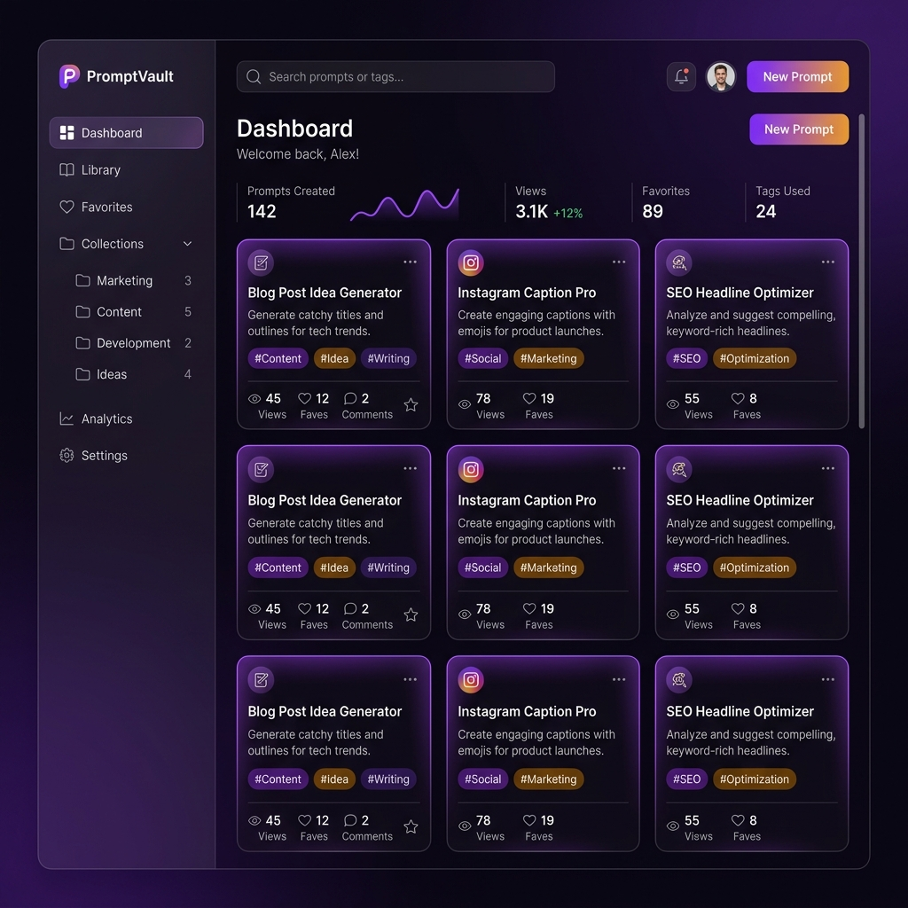
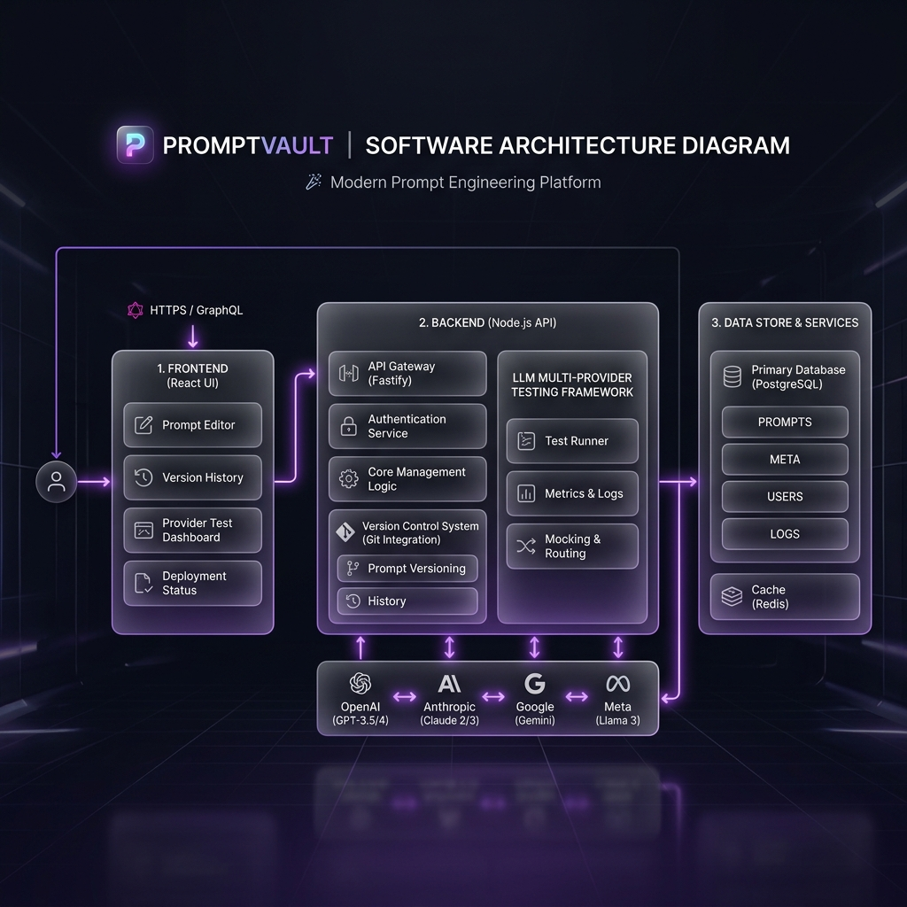

# PromptVault

> **Git for your prompts.** Version control, diff, branch, rollback, and A/B test LLM prompts across OpenAI, Anthropic, and Gemini.

[](LICENSE)
[](#)
[](#)

## 🚀 Live Demo

**[Try the UI → gokulsenthilkumar3.github.io/PromptVault](https://gokulsenthilkumar3.github.io/PromptVault)**

---

## 📸 User Interface



## 🏗️ Architecture



---

## Problem

AI teams write hundreds of prompts with zero version control. A prompt that worked last week breaks today — no history, no diff, no rollback.

## Solution

PromptVault treats prompts as first-class versioned artifacts — just like source code. Every save is a commit. Every variant is a branch. Every model run is tracked.

---

## ✨ Features

| Module | Feature |
|--------|---------|
| **Prompts** | Full CRUD, user-scoped, team-assignable |
| **Versions** | Auto-numbered, full diff with unified patch format |
| **Branches** | Git-like named branches, auto-creates `main` on new prompts |
| **Rollback** | Non-destructive rollback — set branch HEAD to any prior version |
| **Auth** | Supabase JWT guard on every route |
| **LLM Runner** | Run any version against OpenAI, Anthropic, or Gemini |
| **A/B Testing** | Run two versions in parallel, compare output/latency/tokens |
| **Teams** | Workspaces with viewer/editor/admin roles |
| **API Keys** | AES-256-GCM encrypted BYOK storage per user |

---

## 🗂️ Repository Structure

```
PromptVault/
├── promptvault-app/        # React + Vite frontend SPA
├── backend/                # NestJS REST API
│   └── src/
│       ├── prompts/        # Module 1 — Prompt CRUD
│       ├── prompt-versions/# Module 1 — Version history & diff
│       ├── branches/       # Module 2 — Branches & rollback
│       ├── auth/           # Module 3 — Supabase JWT guard
│       ├── runner/         # Module 4 — LLM execution engine
│       ├── ab-test/        # Module 4 — A/B testing
│       ├── teams/          # Module 5 — Team workspaces
│       └── api-keys/       # Module 6 — Encrypted API key vault
├── supabase/
│   └── migrations/         # SQL migrations (001–006)
├── assets/                 # Screenshots & diagrams
└── PRD.md                  # Product Requirements Document
```

---

## 🛠️ Tech Stack

| Layer | Technology |
|-------|-----------|
| Frontend | React 18, Vite, Zustand, Recharts, Fuse.js |
| Backend | NestJS 10, TypeScript |
| Database | Supabase (PostgreSQL + Auth + RLS) |
| LLM Bridge | OpenAI SDK, Anthropic SDK, Google Generative AI |
| Encryption | Node.js `crypto` — AES-256-GCM |
| Deployment | GitHub Pages (frontend), Render (backend) |

---

## 🔌 API Reference

All routes are prefixed with `/api` and require `Authorization: Bearer <supabase-token>`.

### Prompts
| Method | Path | Description |
|--------|------|-------------|
| `GET` | `/api/prompts` | List user's prompts |
| `POST` | `/api/prompts` | Create prompt |
| `GET` | `/api/prompts/:id` | Get prompt |
| `PATCH` | `/api/prompts/:id` | Update prompt |
| `DELETE` | `/api/prompts/:id` | Delete prompt |

### Versions
| Method | Path | Description |
|--------|------|-------------|
| `POST` | `/api/prompts/:id/versions` | Save new version |
| `GET` | `/api/prompts/:id/versions` | List all versions |
| `GET` | `/api/prompts/:id/versions/:vId` | Get version |
| `GET` | `/api/prompts/:id/versions/:vId/diff/:cId` | Diff two versions |

### Branches
| Method | Path | Description |
|--------|------|-------------|
| `GET` | `/api/prompts/:id/branches` | List branches |
| `POST` | `/api/prompts/:id/branches` | Create branch |
| `GET` | `/api/prompts/:id/branches/:name` | Get branch HEAD |
| `POST` | `/api/prompts/:id/branches/:name/rollback/:vId` | Rollback HEAD |
| `DELETE` | `/api/prompts/:id/branches/:name` | Delete branch |

### LLM Runner
| Method | Path | Description |
|--------|------|-------------|
| `POST` | `/api/prompts/:id/versions/:vId/run` | Run version against provider |
| `POST` | `/api/prompts/:id/ab-tests` | Run A/B test |
| `GET` | `/api/prompts/:id/ab-tests` | List A/B tests |
| `PATCH` | `/api/prompts/:id/ab-tests/:id/winner` | Mark winner |

### Teams
| Method | Path | Description |
|--------|------|-------------|
| `POST` | `/api/teams` | Create team |
| `GET` | `/api/teams/me` | My teams |
| `GET` | `/api/teams/:id` | Team details |
| `POST` | `/api/teams/:id/members` | Add member |
| `PATCH` | `/api/teams/:id/members/:uid` | Update role |
| `DELETE` | `/api/teams/:id/members/:uid` | Remove member |
| `DELETE` | `/api/teams/:id` | Delete team |

### API Keys
| Method | Path | Description |
|--------|------|-------------|
| `GET` | `/api/api-keys` | List stored keys (hints only) |
| `POST` | `/api/api-keys` | Save/update key (encrypted) |
| `DELETE` | `/api/api-keys/:provider` | Remove key |

---

## 🚀 Local Development

### Frontend
```bash
cd promptvault-app
npm install
npm run dev       # → http://localhost:3000
```

### Backend
```bash
cd backend
cp .env.example .env   # fill in your Supabase + LLM keys
npm install
npm run start:dev  # → http://localhost:3000/api
```

### Database
Run SQL migrations in order in your Supabase SQL editor:
```
supabase/migrations/001_module1_core_schema.sql
supabase/migrations/002_branches.sql
supabase/migrations/004_ab_tests.sql
supabase/migrations/005_teams.sql
supabase/migrations/006_api_keys.sql
```

---

## 📄 Docs

See [PRD.md](PRD.md) for full product requirements and roadmap.

## License

MIT
